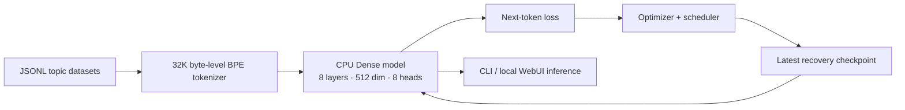

# Tantra-LLM architecture

## Design boundary

Tantra is currently a small, CPU-first research implementation. The supported
training architecture is the dense CPU profile, not a distributed trillion-
parameter system. A checkpoint must always be loaded into the same tokenizer,
vocabulary size, dimensions, layer count, attention type, and category-layer
layout that created it.



## Maintained CPU profile

| Part | Current default | Reason |
|---|---|---|
| Vocabulary | 32,768 BPE tokens + byte fallback | A practical CPU output-head cost |
| Backbone | 8 × 512-dimension blocks, 8 heads | Better CPU speed/quality balance than the legacy 178M shape |
| Attention | Standard causal attention | Current training profile; ALRA remains benchmarkable |
| MLP | Dense SwiGLU | Performs dense CPU work honestly; no sparse-mask speed claim |
| Embeddings | Tied input/output | Removes duplicate output embedding parameters |
| Checkpoints | One `Latest` recovery file | Resumes safely without archive duplication |

The model has roughly 38.6M trainable parameters at 32K vocabulary. Its exact
count belongs to the checkpoint config, not this document: changing vocabulary
or layer shape changes it.

## Profile comparison

`Tantra.model` contains explicit CPU-profile builders for controlled tests:

| Profile | Purpose | Status |
|---|---|---|
| `dense` | Default CPU training/inference model | Maintained |
| `micro10` | Small baseline for speed/distillation experiments | Experimental |
| `moe2` | Two-expert real top-1 routing comparison | Experimental; measure it before adopting |

The MoE profile invokes separate expert MLPs and has a real routing decision.
It is not automatically faster on CPU; routing and smaller batches can remove
any theoretical gain. The project does not claim a large expert bank or
automatic worldwide knowledge expansion.

## System components and controlled settings

- **ALRA**: an alternate attention implementation. It is retained for
  benchmarking; the default CPU run uses causal attention.
- **BitNet**: ternary quantization utilities retained for quantization and
  inference experiments.
- **DNA codec**: model-artifact compression and integrity utilities.
- **MoE**: routing and expert-registry implementation; the two-expert profile
  is a controlled CPU comparison, not an automatic speed claim.
- **MTP and latent reasoning**: disabled for base CPU pretraining because they
  add output-projection work. Enable only for an evaluated later fine-tune.
- **Category layers/adapters**: optional per-domain residual blocks. They begin
  with a zero residual gate so merely installing a category does not change the
  base model. They require held-out evaluation before growth or pruning.
- **Auto-growth**: adds capacity only after a sustained validation/EMA plateau.
  It cannot losslessly shrink a checkpoint or change vocabulary size; either
  operation needs conversion plus further training.
- **Self-repair**: detects numerical issues and repairs invalid/exploding
  tensors. It is a stability mechanism, not evidence of model learning.
- **TokenJuice**: dataset signal/entropy processing used by offline preparation
  and training support code.

## Training and checkpoint lifecycle

`NeuroTrainer` records model, optimizer, scheduler, step, best loss, token
count, and model config. The config is embedded so compatible loaders can
rebuild the checkpoint architecture rather than silently run random weights.

```text
train → measure → save Model/<profile>/Latest/checkpoint_latest.pt
                  ↓
          restart with --resume
                  ↓
         restore architecture + optimizer + scheduler
```

The legacy `Model/Best` and `Model/Checkpoints` directories are optional for
generic runs. The maintained CPU launcher disables them. Checkpoints and
datasets are intentionally excluded from Git.

## Code organization

| Location | Responsibility |
|---|---|
| `Tantra/` | Model, training, data, tokenizer, evaluation, adapters, and offline data utilities |
| `webui/` | Local FastAPI backend, page, CSS/JS assets, and Windows launchers |
| `main.py` | General CLI and integration point |
| `Tests/` | Automated tests |

Supported CPU training/chat/benchmark commands are in `Tantra.cpu_cli`.

## Non-goals and verification

The following are not verified production capabilities: trillion-parameter
scaling, 500-expert lazy loading, GPU acceleration on this CPU run, multimodal
training quality, or claimed BitNet speedups. Every architecture or speed
change should be tested with the same dataset, sequence length, batch size,
threads, and measured tokens/second.
