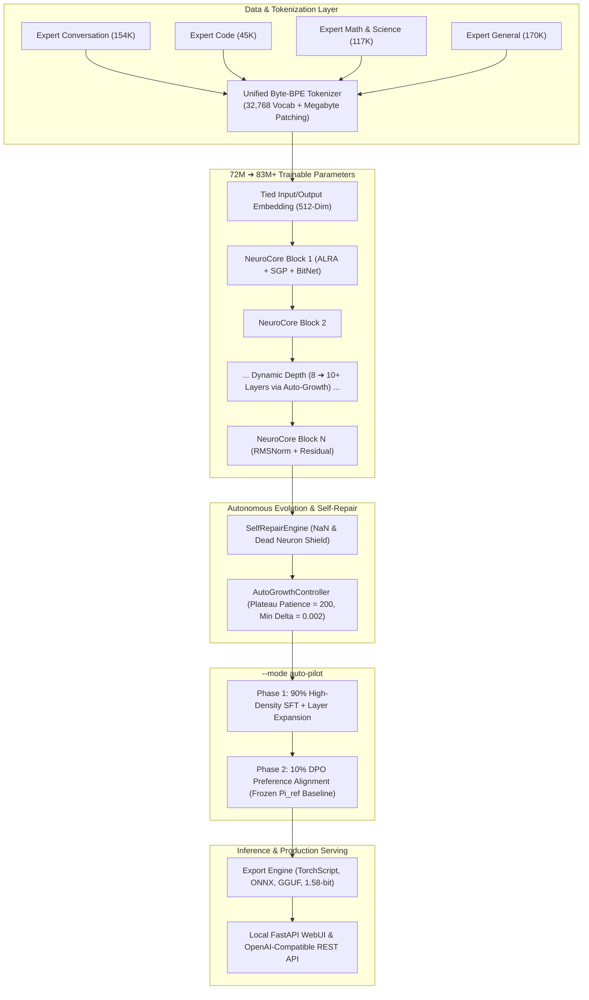

# 🏛️ Tantra-LLM: NeuroCore Architecture & Systems Specification

## 1. High-Level Architectural Blueprint

**Tantra-LLM** is an on-device, CPU-first, and multi-GPU accelerated foundation model engineered with the **NeuroCore** architecture. It is designed to maximize reasoning efficiency and factual accuracy while maintaining a sub-250MB memory footprint.

---

## 2. Core Architectural Components

| Component | Technical Implementation | Operational Mechanism |
| :--- | :--- | :--- |
| **Backbone Dimensions** | 8 ➔ 10+ Layers, 512 Hidden Dimension, 8 Attention Heads | Auto-grown dynamically from 72.2M to 82.8M+ parameters |
| **Unified Vocabulary** | 32,768 BPE Tokens + Megabyte Byte-Fallback Patcher | Zero out-of-vocabulary (`<unk>`) tokenization failures |
| **Attention Engine** | **ALRA** (Adaptive Linear Resonance Attention) | $O(1)$ recurrent memory state replacing $O(N^2)$ quadratic cost |
| **Feed-Forward Engine** | **SGP** (Sparse Gated Projections) + **BitNet 1.58-bit** | Top-$k$ gating with ternary quantization weights $\{-1, 0, +1\}$ |
| **Speculative Decoding** | **MTP** (Multi-Token Prediction) | Dual concurrent heads $(t+1, t+2)$ providing $2\times$ CPU generation speed |
| **Autonomous Evolution** | **AutoGrowthController** | Monitors loss EMA; clones and perturbs top layer on plateaus |
| **Preference Alignment**| **Direct Preference Optimization (DPO)** | Optimizes log-ratio margin against frozen $\pi_{\text{ref}}$ reference model |
| **Multi-Modality** | Single-Weight Patch Projection Matrices | Directly projects Vision patches and Audio mel-spectrograms into LLM space |

---

## 3. Autonomous Pipeline (`--mode auto-pilot`)

The auto-pilot pipeline executes end-to-end foundation model training in a single command:
1. **Phase 1 (90% Total Steps)**: Supervised Fine-Tuning (SFT) across the 4-track curriculum with active layer auto-growth.
2. **Phase 2 (10% Total Steps)**: Autonomous transition to DPO pairwise preference optimization (`Datasets/preference_pairs.jsonl`) to eliminate hallucinations, enforce clean code blocks, and polish persona.

---

## 4. Multi-Level Evaluation Suite

Evaluations follow standard frontier AI lab methodologies:
* **GSM8K Math**: Step-by-step arithmetic derivation and numerical exact-match extraction.
* **HumanEval Code Sandbox**: Subprocess execution of generated Python code against 164 unit tests (`pass@1`).
* **Zero-Shot MMLU**: Cross-entropy log-likelihood multi-choice ranking across 50+ world knowledge subjects.
* **Held-Out Perplexity**: Exponential cross-entropy loss $\exp(\mathcal{L})$ on 10,000 unseen validation tokens.
