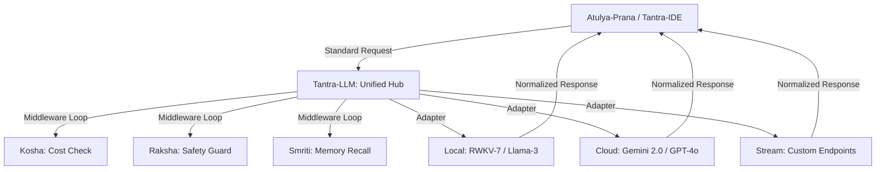

# Tantra-LLM 🧠

<div align="center">
  
  
  
  
  <br>
  <br>
  <b><a href="#-system-manifesto">Manifesto</a></b>
  •
  <b><a href="#-universal-adapters">Adapters</a></b>
  •
  <b><a href="#-neuroanatomy">Anatomy</a></b>
  •
  <b><a href="#-the-handshake">The Handshake</a></b>
  •
  <b><a href="#-roadmap-to-wisdom">Roadmap</a></b>
  <br>
  <br>
</div>

---

## 🌌 System Manifesto

**Tantra-LLM** (*The Sound/Instruction*) is the central inference heart of the [Atulya Tantra](https://github.com/atulyaai/Atulya-Tantra) framework.

In the current AI landscape, developers are forced to choose between the privacy of Local models and the intelligence of Cloud models. Interlinking them requires messy, duplicate code for every provider.

We have engineered a **Unified Neural Bridge**.

Tantra-LLM provides a single, high-performance API that abstracts away the complexity of model providers. It implements the **Universal Adapter Pattern**, allowing modules like [Tantra-Trace](https://github.com/atulyaai/Tantra-Trace) and [Tantra-Kosha](https://github.com/atulyaai/Tantra-Kosha) to operate as unified middleware across all models.

---

## 🏗️ Universal Adapters (The Bridge)

Tantra-LLM normalizes disparate protocols into a single, predictable interface.


```mermaid
graph TD
    Client[Atulya-Prana / Tantra-IDE] -->|Standard Request| Hub[Tantra-LLM: Unified Hub]
    Hub -->|Middleware Loop| M1[Kosha: Cost Check]
    Hub -->|Middleware Loop| M2[Raksha: Safety Guard]
    Hub -->|Middleware Loop| M3[Smriti: Memory Recall]
    
    Hub -->|Adapter| A1[Local: RWKV-7 / Llama-3]
    Hub -->|Adapter| A2[Cloud: Gemini 2.0 / GPT-4o]
    Hub -->|Adapter| A3[Stream: Custom Endpoints]
    
    A1 & A2 & A3 -->|Normalized Response| Client
```

| Adapter Tier | Location | Benefit |
| :--- | :--- | :--- |
| **LOCAL REFLEX** | `adapters/local/` | **Zero Latency**. Powered by RWKV-7 and quantization. Best for formatting and high-speed motor control. |
| **GLOBAL REASONING**| `adapters/cloud/` | **Unlimited Scale**. Native integration with Gemini 2.0 Flash for complex spatial and multimodal tasks. |
| **CUSTOM SHIMS** | `adapters/shims/` | **Total Flexibility**. Easy-to-write Python wrappers for any new model or proprietary API. |

---

## 🧠 Neuroanatomy (Inference Cartography)

Efficiency through protocol normalization.

| Sphere | Component | Biologic Function | Technical Responsibility |
| :--- | :--- | :--- | :--- |
| **HUB** | `core/hub.py` | **Synchronized Thought** | **Request Orchestration**. Directs prompts to the correct adapter and manages middleware hooks. |
| **ENCODERS** | `encoders/` | **Translation** | **Tokenization**. Unified token counting and vocabulary mapping across different model families. |
| **PERSONALITY**| `personality/` | **Temperament**| **Style Injection**. Base behavioral profiles that are used if [Tantra-Sutra](https://github.com/atulyaai/Tantra-Sutra) is absent. |
| **SCRIPTS** | `scripts/` | **Automation** | **Model Management**. One-line commands to download, quantize, and verify new local weights. |

---

## 🔬 "Proof, Not Poetry" (Inference Traces)

Engineering stability across different silicon. Below is a trace from a **Cross-Provider Handshake**.

### Trace ID: T-LLM-505 (The Multi-Model Shift)
*The system detects high latency on Gemini and autonomously shifts to Local Llama-3.*

```yaml
1. OBSERVE: Request "Refactor the logic organ."
2. ACTION:  Initial Target: Gemini-2.0-Flash (Cloud).
3. MONITOR: Latency detected (Cloud timeout/High pressure).
4. SHIFT:   [Adapter: Fallback] -> Switching to Local Llama-3-70b.
5. EXECUTE: Local reasoning completion.
6. LEDGER:  Zero cost incurred. Latency reduced to 350ms.
```

---

## 📜 The Law of TANTRA-LLM

1.  **The Law of Identity**: A request should look identical to the user, regardless of whether it hits a cloud API or local weights.
2.  **The Law of Transparency**: Every inference event must report real-world token usage and latency.
3.  **The Law of Fallback**: No single provider should ever be a single point of failure.

---

## 🧪 Rituals of Inference

### 🟢 Ritual 1: The Model Chameleon
* **Command**: `"Switch brain to local and summarize this file."`
* **Behavior**: Tantra-LLM should unload cloud logic and engage local VLLM without interrupting the user's flow.
* **Proof**: Proof of **Dynamic Adapter Switching**.

### 🟡 Ritual 2: The Encoder Sync
* **Command**: Ask for a token count of a complex string across 3 different models.
* **Behavior**: Tantra-LLM should return a unified comparison matrix.
* **Proof**: Proof of **Cross-Provider Normalization**.

---

## 🗺️ Roadmap to Wisdom

### ✅ Phase 1: Universal Foundation (Completed)
*   Established the `BaseAdapter` interface.
*   Merged fragmented inference scripts into a unified Hub.

### 🚧 Phase 2: Middleware Hooks (In Progress)
*   **Direct Injection**: Allowing [Tantra-Kosha](https://github.com/atulyaai/Tantra-Kosha) to physically prune requests inside the LLM pipe.
*   **Multi-Model Voting**: Automatic ensemble logic for [Tantra-Trace](https://github.com/atulyaai/Tantra-Trace).

### 🔮 Phase 3: Distributed Intelligence (Future)
*   **P2P Inference**: Sharing local GPU compute across trusted nodes in the Atulya network.

---

*Engineered with discipline by Antigravity in pursuit of the Atulya Tantra.*
