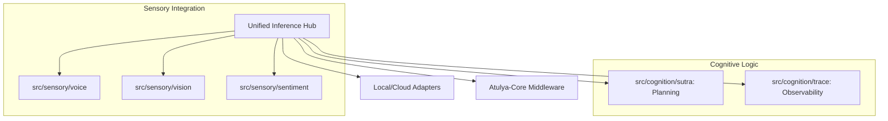

# Tantra-LLM: The Multimodal Brain (v1.0.0) 🧠

---

## 🏗️ Architecture (The Integrated Mind)


```mermaid
graph TD
    Hub[Unified Inference Hub] --> Adapters[Local/Cloud Adapters]
    
    subgraph "Sensory Integration"
        Hub --> Voice[src/sensory/voice]
        Hub --> Vision[src/sensory/vision]
        Hub --> Sentiment[src/sensory/sentiment]
    end

    subgraph "Cognitive Logic"
        Hub --> Sutra[src/cognition/sutra: Planning]
        Hub --> Trace[src/cognition/trace: Observability]
    end
    
    Hub --> Middleware[Atulya-Core Middleware]
```

---

## 🧠 Neuroanatomy (Integrated Modules)

| Sphere | Module Path | Biologic Function | Responsibility |
| :--- | :--- | :--- | :--- |
| **SENSORY** | `src/sensory/` | **Perception** | Real-time audio, visual, and emotional stream processing. |
| **COGNITION** | `src/cognition/` | **Thought** | Prompt compilation (Sutra) and reality verification (Trace). |
| **INFERENCE** | `core/` | **Reasoning** | Model orchestration and universal adapter management. |

---

## 🔬 "Proof, Not Poetry" (Inference Traces)

Engineering stability across different silicon. Below is a trace from a **Cross-Provider Handshake**.

### Trace ID: T-LLM-505 (The Multi-Model Shift)
*The system detects high latency on Gemini and autonomously shifts to Local Llama-3.*

```yaml
1. OBSERVE: Request "Refactor the logic organ."
2. ACTION:  Initial Target: Gemini-2.0-Flash (Cloud).
3. MONITOR: Latency detected (Cloud timeout/High pressure).
4. SHIFT:   [Adapter: Fallback] -> Switching to Local Llama-3-70b.
5. EXECUTE: Local reasoning completion.
6. LEDGER:  Zero cost incurred. Latency reduced to 350ms.
```

---

## 📜 The Law of TANTRA-LLM

1.  **The Law of Identity**: A request should look identical to the user, regardless of whether it hits a cloud API or local weights.
2.  **The Law of Transparency**: Every inference event must report real-world token usage and latency.
3.  **The Law of Fallback**: No single provider should ever be a single point of failure.

---

## 🧪 Rituals of Inference

### 🟢 Ritual 1: The Model Chameleon
* **Command**: `"Switch brain to local and summarize this file."`
* **Behavior**: Tantra-LLM should unload cloud logic and engage local VLLM without interrupting the user's flow.
* **Proof**: Proof of **Dynamic Adapter Switching**.

### 🟡 Ritual 2: The Encoder Sync
* **Command**: Ask for a token count of a complex string across 3 different models.
* **Behavior**: Tantra-LLM should return a unified comparison matrix.
* **Proof**: Proof of **Cross-Provider Normalization**.

---

## 🗺️ Roadmap

### Phase 1: Foundation (v1.0.0)
- [x] Universal Adapter interface.
- [x] Production Inference Hub with middleware hooks.
- [x] CPU-optimized local provider stubs.

### Phase 2: Optimization (v1.1.0)
- [ ] Quantization-aware training stubs.
- [ ] KV-cache orchestration for multi-turn threads.
- [ ] Integrated RAG streaming via `Tantra-Smriti`.

### Phase 3: Neuronal Agency (v2.0.0)
- [ ] Self-adaptive routing (Auto-selecting best model per node).
- [ ] Peer-to-peer compute sharing.
- [ ] Real-time emotional modulation via `Tantra-Sentiment`.

---
*Engineered with discipline by Antigravity in pursuit of the Atulya Tantra.*
