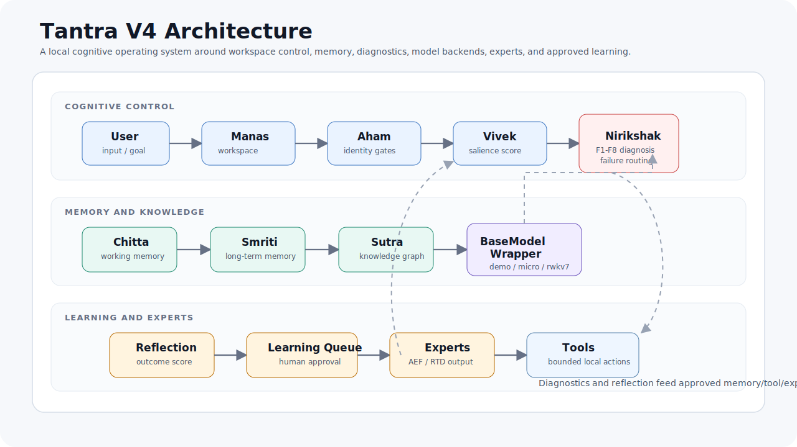
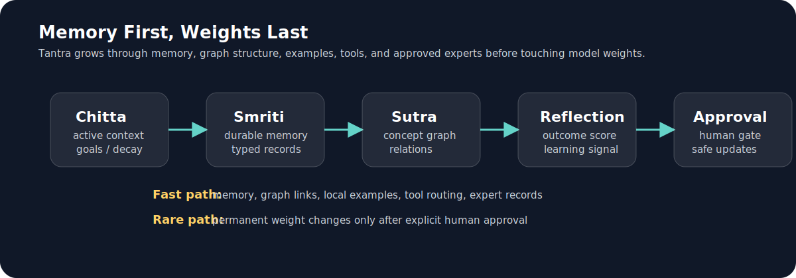

# NP-DNA: NeuroPlastic DNA Network

<p align="center">
  
</p>

<p align="center">
  
  
  
  
</p>

NP-DNA is a CPU-first, local language-model prototype built around dynamic vocabulary growth, sparse mixture-of-strands routing, low-rank DNA-style weight generation, and a persistent retrieval cortex.

```text
NP-DNA = AtulyaTokenizer + Genome + Sparse Mesh Layers + Memory Cortex + Generation / Agent Helpers
```

The current checkout is centered on the `npdna` package. It includes model architecture, tokenizer, generation, checkpointing, training, memory, topic classification, a ReAct-style agent wrapper, CPU optimization helpers, and practical multimodal prompt builders.



## Current Features

| Area | Status | Notes |
| --- | --- | --- |
| Dynamic tokenizer | Built | BPE-style tokenizer with byte fallback, Devanagari/Vedic base characters, save/load, and capacity growth. |
| Model core | Built | `NpDnaModel` and `NpDnaCore` wrap embeddings, mesh layers, cortex, checkpointing, and generation. |
| Genome | Built | Shared low-rank strand parameter generation via `Genome`. |
| Sparse mesh | Built | `NeuralMesh`, `CategoryMesh`, top-k routing, load-balancing loss, and strand usage tracking. |
| Strands | Built | SSM-style strands plus attention strand support. |
| Dynamic growth | Built | Runtime strand growth, layer addition, and embedding resize paths. |
| Memory cortex | Built | Dense in-process memory store with retrieval and augmentation. |
| Generation | Built | Standard and streaming generation with temperature, top-k, top-p, repetition penalty, token suppression, and prompt formatting. |
| Checkpointing | Built | Saves/loads model, tokenizer, metadata, cortex, component format, and sharded format. |
| Training | Built | `npdna/train_npdna_v3.py` local trainer with configurable staged data loading. |
| Agent wrapper | Built | `NpDnaAgent` with cortex search/store and safe expression tools. Network-backed tools should stay disabled or reviewed in production. |
| Classification | Built | `NpDnaTopicClassifier` and `tag_text` helpers. |
| Multimodal context | Practical bridge | Converts image/audio/JSON metadata into text context; not a learned multimodal embedding path yet. |
| CPU optimization | Experimental | Quantization, torch compile, thread tuning, parameter counting, and partial-freezing helpers. |



## Repository Structure

```text
Tantra LLM/
|-- npdna/
|   |-- __init__.py              # Public exports
|   |-- autonomy.py              # ReAct-style agent and safe math evaluator
|   |-- classifier.py            # Topic classifier helpers
|   |-- codecs.py                # Frozen codec registry
|   |-- config.py                # Dynamic config, layer specs, presets
|   |-- cortex.py                # Memory cortex and auto-store helpers
|   |-- generation.py            # Text generation and streaming generation
|   |-- genome.py                # Low-rank genome module
|   |-- mesh.py                  # Sparse mesh, category mesh, strands
|   |-- model.py                 # NpDnaModel, NpDnaCore, checkpointing
|   |-- multimodal_context.py    # Image/audio/structured prompt context bridge
|   |-- plasticity.py            # Growth metrics and autoscaling engine
|   |-- quant_turbo.py           # CPU quantization/optimization helpers
|   |-- tokenizer.py             # AtulyaTokenizer plus audio/vision feature shells
|   `-- train_npdna_v3.py        # Curriculum training script
|-- assets/
|   |-- tantra-architecture.svg
|   |-- tantra-banner.svg
|   `-- tantra-memory-learning.svg
|-- model/                       # Local generated model artifacts
|   |-- .gitkeep
|   `-- tokenizer/
|-- pyproject.toml
|-- requirements.txt
|-- LICENSE
`-- README.md
```

## Quick Start

```powershell
python -m venv .venv
.\.venv\Scripts\Activate.ps1
pip install -r requirements.txt
```

Create a fresh core:

```python
import torch
from npdna import NpDnaCore

core = NpDnaCore.from_config("seed")
ids = core.encode("Hello from NP-DNA")
logits, balance_loss = core.model(torch.tensor([ids]))
print(logits.shape, balance_loss.item())
```

Load a local checkpoint when available:

```python
from npdna import NpDnaCore

core = NpDnaCore.load("model/npdna_v3/best")
text = core.generate(
    "What is gravity?",
    max_tokens=100,
    temperature=0.35,
    top_k=30,
    top_p=0.85,
    repetition_penalty=1.2,
)
print(text)
```

## Training

The training script is intended for local/private training data. Keep datasets, checkpoints, logs, and generated archives out of Git unless they are explicitly sanitized and meant for release.

```powershell
$env:KMP_DUPLICATE_LIB_OK="TRUE"
python npdna\train_npdna_v3.py
```

Default script settings:

| Setting | Value |
| --- | --- |
| Config | `nano` |
| Attention | Enabled |
| Batch size | 4 |
| Sequence length | 128 |
| Learning rate | `5e-3` |
| Checkpoints | Local `model/` output |
| Tokenizer assets | Local `model/tokenizer/` output |

## Config Presets

`NpDnaCore.from_config(...)` accepts a preset name or a numeric complexity value.

| Preset | Complexity | Hidden size | Layers | Strands/layer | Initial vocab |
| --- | ---: | ---: | ---: | ---: | ---: |
| `seed` | 1.0 | 64 | 5 | 7 | 4096 |
| `nano` | 2.0 | 128 | 5 | 9 | 8192 |
| `micro` | 4.0 | 256 | 5 | 12 | 16384 |
| `small` | 6.0 | 384 | 5 | 15 | 24576 |
| `medium` | 8.0 | 512 | 5 | 18 | 32768 |
| `large` | 12.0 | 768 | 5 | 24 | 49152 |

All presets use dynamic layer specs by default: conversation, code, math, science, and writing.

## Generation

```python
core.generate(
    prompt="Explain sparse routing in simple terms.",
    max_tokens=100,
    temperature=0.35,
    top_k=12,
    top_p=1.0,
    repetition_penalty=1.12,
)
```

Streaming is also available:

```python
for token in core.generate_stream("Write one sentence about memory.", max_tokens=40):
    print(token, end="", flush=True)
```

## Agent Use

```python
from npdna import NpDnaAgent, NpDnaCore

core = NpDnaCore.from_config("seed")
agent = NpDnaAgent(core)

agent.register_tool("echo", lambda text: text)
print(agent.run("Use math_eval to calculate sqrt(81)."))
```

For public or shared deployments, review every enabled agent tool before use. Keep network access, file writes, and code execution behind explicit policy controls.

## Multimodal Context Bridge

The multimodal helper is intentionally explicit: it turns file metadata or structured JSON into plain text context that the model can consume.

```python
from npdna.multimodal_context import build_multimodal_prompt

prompt = build_multimodal_prompt(
    "Summarize this input.",
    image="assets/tantra-architecture.svg",
    structured={"project": "NP-DNA", "mode": "local"},
)
print(prompt)
```

## Assets

Visual assets live in `assets/` and are referenced by this README:

| File | Purpose |
| --- | --- |
| `assets/tantra-banner.svg` | Header/banner image. |
| `assets/tantra-architecture.svg` | Architecture diagram. |
| `assets/tantra-memory-learning.svg` | Memory and learning diagram. |

## What Is Missing

These are the main gaps visible in the current repo:

| Gap | Why it matters |
| --- | --- |
| `pyproject.toml` metadata is stale | It declares package/scripts under `tantra.*`, but the actual package here is `npdna`. Editable installs and console scripts may fail until this is corrected. |
| No test suite in the checkout | `pyproject.toml` points to `tantra/tests`, but no matching tests are present. Core tokenizer/model/checkpoint/generation tests would reduce regression risk. |
| No CLI or app entrypoint | The repo has library and training code, but no working `tantra-chat`, `tantra-ui`, or `tantra-api` implementation in the current structure. |
| No CI configuration | There is no automated lint/test workflow yet. |
| No lockfile | Dependencies are listed, but versions are not locked for reproducible training/inference environments. |
| Public release policy is thin | Add guidance for what can be committed, what must stay private, and how to sanitize examples before release. |
| Multimodal support is not learned end-to-end | Current multimodal context is metadata-to-text, while `AudioEncoder` and `VisionEncoder` are feature shells. |
| Agent web/code tools need hardening | The agent exposes useful hooks, but production use should add permissions, sandboxing policy, timeouts, and clearer tool contracts. |
| Quantization is experimental | CPU optimization helpers exist, but there is no benchmark table or compatibility matrix. |
| Packaging name mismatch | Project name is `tantra`, but importable code is `npdna`; choose one public package identity or document both deliberately. |

## Security Notes

Before publishing changes, check for:

| Check | Current guidance |
| --- | --- |
| Secrets | Do not commit API keys, private tokens, credentials, or `.env` files. |
| Training data | Do not publish raw local datasets or dataset inventories unless they are intentionally public. |
| Model artifacts | Treat checkpoints, tokenizer dumps, logs, and generated archives as local artifacts by default. |
| Agent tools | Review any tool that can access the network, execute code, or write memory before enabling it outside local development. |

## Verification

Basic import check:

```powershell
python -c "from npdna import NpDnaCore; core = NpDnaCore.from_config('seed'); print(core.model.parameter_count())"
```

Run training:

```powershell
python npdna\train_npdna_v3.py
```

## License

MIT License. See [LICENSE](LICENSE).
