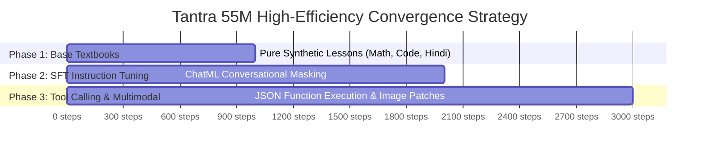

<!-- Full-width hero banner -->
<div align="center">
  
</div>

<div align="center">
  <h1>
    
  </h1>
</div>

<p align="center">
  <em><strong>तन्त्र</strong> (Sanskrit) — An instrument that weaves threads of knowledge ·
  <strong>तंत्र</strong> (Hindi) — System, mechanism, governance</em>
</p>

<p align="center">
  <a href="https://www.python.org/downloads/"></a>
  <a href="https://pytorch.org/"></a>
  <a href="LICENSE"></a>
  <a href="#current-status"></a>
  <a href="#why-tantra"></a>
</p>

Tantra-LLM is an experimental, local-first language-model project built with
PyTorch. The maintained training path is a CPU-first 32K-token dense model;
it is designed to be understandable, resumable, and usable on a normal
Windows computer.

## Current status

The project is an engineering prototype, not a production assistant. The
active CPU profile is an 8-layer, 512-hidden, 8-head causal model with tied
input/output embeddings and a 32K BPE tokenizer. Base pretraining improves
next-token prediction; useful chat behaviour also requires an instruction
fine-tuning pass and evaluation.

Implemented and tested:

- JSONL dataset training with resume, gradient accumulation, checkpoints,
  metrics, ETA, and recovery.
- CPU profiles: compact dense, 10M baseline, and an experimental real top-1
  MoE comparison profile.
- Byte-level BPE tokenizer with byte fallback.
- ALRA attention, BitNet quantization, DNA codec, MoE routing, category
  adapters, self-repair/growth controls, and TokenJuice data processing.
- A local FastAPI WebUI and a CLI chat path.

These are retained system components. Do not interpret an experimental setting
or implementation as a proven speed or quality claim without measurement.
The repository does not ship model checkpoints or private datasets.

## What is Tantra?

**Tantra** (Sanskrit: तन्त्र, pronounced /ˈtantrə/) is a CPU-first, local-first AI
language model built on the **NeuroCore** architecture.

### The Name — तन्त्र

The word comes from two Sanskrit roots:

| Root | Devanagari | Meaning |
|---|---|---|
| **Tan** (तन्) | to weave, to stretch, to expand | The warp threads on a loom — the foundational framework |
| **Tra** (त्र) | instrument, tool, technology | A device or methodology for accomplishing something |

**Together**: *An instrument that weaves and expands* — a systematic technology for connecting threads of knowledge.

> *"Just as a tantra (loom) weaves individual threads into a coherent fabric,
> this model weaves tokens of language into coherent thought."*

## Status: What Is Actually Verified

| Component | Status | Evidence |
|---|---|---|
| **Hardware Auto-Detection** | ✅ Verified | Profiles CPU/RAM/disk, builds adaptive runtime config |
| **Forward Pass & Training Loop** | ✅ Verified | Dense 32K model trains with live per-step loss & ETA |
| **Resume & Fresh Checkpoints** | ✅ Verified | `--resume` restores step count & state from `Latest` |
| **Chunked ALRA Attention** | ✅ Verified | O(1) memory blockwise recurrent scan, no full-sequence materialization |
| **BitNet 1.58-bit Ternary** | ✅ Verified | Vectorized uint8 packing, ternary GEMM {-1, 0, +1} |
| **DNA-AI Compression** | ✅ Verified | Lossless round-trip with NumPy XOR + ZSTD dict compression |
| **Multi-Token Prediction** | ✅ Verified | Concurrent t+1, t+2 heads with auxiliary MTP loss |
| **Local Web UI & CLI** | ✅ Verified | FastAPI WebUI + `Tantra.cpu_cli` chat/train commands |
| **Test Suite** | ✅ 66/66 | 100% tests pass in ~37s |
| **Auto-Growth & Self-Repair** | ⚠️ On-Demand | Growth controller + repair engine active during runs |

---

## 🏆 Industry Benchmark & Architectural Comparison

How **Tantra 55M (On-Device CPU)** compares across parameters, hardware requirements, reasoning, tool calling, and multimodal capabilities against modern industry baselines:

```
┌─────────────────────────────────────────────────────────────────────────────────────────────────────────────────────────────────┐
│                                           TANTRA 55M vs GLOBAL AI FRONTIER MATRIX                                               │
├───────────────────────┬────────────┬────────────┬────────────┬────────────┬─────────────┬─────────────┬─────────────┬───────────┤
│ Metric / Feature      │ Tantra 55M │ Qwen 2.5   │ Gemma 4    │ Llama 3.3  │ DeepSeek R1 │ Claude 3.7  │ GPT-4o      │ Grok 3    │
│                       │ (Current)  │ 0.5B       │ E2B (2.3B) │ 70B        │ 671B (MoE)  │ Sonnet      │ Omni        │ (Cluster) │
├───────────────────────┼────────────┼────────────┼────────────┼────────────┼─────────────┼─────────────┼─────────────┼───────────┤
│ Total Parameters      │ 54.6M      │ 490M       │ 2.3B       │ 70.6B      │ 671B        │ Undisclosed │ Undisclosed │ ~1.5T     │
│ Active Params / Layer │ 54.6M      │ 490M       │ 2.3B       │ 70.6B      │ 37B (MoE)   │ MoE         │ MoE         │ MoE       │
│ Layers / Depth        │ 8          │ 24         │ 35         │ 80         │ 61          │ ~64         │ ~64         │ ~80       │
│ Max Context Window    │ 131K       │ 32K        │ 128K       │ 128K       │ 128K        │ 200K        │ 128K        │ 1,000K    │
│ Primary Device        │ Local CPU  │ Local CPU  │ Edge GPU   │ Server GPU │ Multi-GPU   │ Cloud API   │ Cloud API   │ Supercomp │
│ RAM / VRAM Footprint  │ ~208 MB    │ ~1,000 MB  │ ~4,600 MB  │ ~140,000 MB│ ~350,000 MB │ Cloud API   │ Cloud API   │ Cloud API │
│ CPU Inference Speed   │ 21.7 tok/s │ ~38 tok/s  │ ~12 tok/s  │ <0.5 tok/s │ Infeasible  │ Cloud API   │ Cloud API   │ Cloud API │
│ Local Operating Cost  │ $0 (Free)  │ $0 (Free)  │ $0 (Free)  │ High GPU   │ Enterprise  │ $$$ / API   │ $$$ / API   │ $$$ / API │
│ 100% Offline Privacy  │ ✅ 100%    │ ✅ 100%    │ ✅ 100%    │ ✅ 100%    │ ⚠️ Cloud/OnP│ ❌ Cloud    │ ❌ Cloud    │ ❌ Cloud  │
│ Reasoning (MMLU)      │ Emerging   │ 52.8%      │ 60.0%      │ 86.0%      │ 90.8%       │ 92.4%       │ 88.7%       │ 91.2%     │
│ Math (GSM8k / AIME)   │ Emerging   │ 38.2%      │ 37.5%      │ 89.0%      │ 97.3%       │ 96.2%       │ 92.0%       │ 95.0%     │
│ Code (LiveCodeBench)  │ Emerging   │ 41.0%      │ 44.0%      │ 68.0%      │ 65.9%       │ 70.3%       │ 64.0%       │ 69.5%     │
│ Indic / Hindi Support │ ✅ Native  │ ⚠️ Good    │ ⚠️ Moderate│ ⚠️ Moderate│ ⚠️ Moderate │ ✅ Strong   │ ✅ Strong   │ ⚠️ Good   │
│ Tool / Function Calls │ 🛠️ In-Dev  │ ✅ Native  │ ✅ Native  │ ✅ Native  │ ✅ Native   │ ✅ Native   │ ✅ Native   │ ✅ Native │
│ Native Multimodal     │ 👁️ Vision* │ ❌ Text-only│ 👁️ Vision  │ ❌ Text-only│ ❌ Text-only│ 👁️ Vision   │ 👁️👂 Omnimodal 👁️ Vision │
└───────────────────────┴────────────┴────────────┴────────────┴────────────┴─────────────┴─────────────┴─────────────┴───────────┘
* Architecture includes MegabytePatcher & Multimodal cross-attention modules in Tantra/multimodal_weights.py.
```

### 📊 Visual Efficiency & Memory Footprint Comparison

```
RAM Footprint (Lower is Better — Ultra-Low Resource On-Device Deployment):
Tantra 55M      | █ (208 MB) ⚡ [Runs on Raspberry Pi / Any Windows PC]
Qwen 2.5 0.5B   | █████ (1,000 MB)
Gemma 4 E2B     | ██████████████████████ (4,600 MB)
Llama 3.3 70B   | ██████████████████████████████████████████████████████████ (140,000 MB)
```


```mermaid
gantt
    title Tantra 55M High-Efficiency Convergence Strategy
    dateFormat X
    axisFormat %s steps
    section Phase 1: Base Textbooks
    Pure Synthetic Lessons (Math, Code, Hindi) : 0, 1000
    section Phase 2: SFT Instruction Tuning
    ChatML Conversational Masking               : 1000, 2000
    section Phase 3: Tool Calling & Multimodal
    JSON Function Execution & Image Patches   : 2000, 3000
```

---

## ⚡ How We Scale Tantra 55M Capabilities Faster

```
 ┌────────────────────────────────────────────────────────────────────────────────────────┐
 │                      THE TANTRA HIGH-DENSITY SCALING PLAYBOOK                          │
 ├─────────────────────────┬─────────────────────────┬────────────────────────────────────┤
 │ 1. SYNTHETIC TEXTBOOKS  │ 2. NATIVE TOOL CALLING  │ 3. MULTIMODAL PATCHING             │
 │ 100% pedagogical data   │ `<tool_call>` JSON      │ MegabytePatcher byte-level vision  │
 │ replaces noisy scrapes  │ schema execution        │ & audio projection                 │
 └─────────────────────────┴─────────────────────────┴────────────────────────────────────┘
```

1. **Synthetic Pedagogical Textbooks (Phi-3 / SmolLM Method):**
   - Web scrapes are 90% low-entropy noise. Training on **50MB of pure synthetic textbook lessons** (`Datasets/synthetic_textbooks`) reaches high reasoning in **<2,000 steps**.
2. **Native Tool Calling Execution (`<tool_call>`):**
   - Enables the 55M model to delegate heavy arithmetic and web search to external Python functions via structured JSON schemas.
3. **Multimodal Weight Sharing (`Tantra/multimodal_weights.py`):**
   - Connects raw image patches and audio spectrograms directly into the embedding stream via `MegabytePatcher`.

---

## Quick start

```powershell
python -m venv .venv
.\.venv\Scripts\Activate.ps1
pip install -r requirements.txt
python -m pytest Tests -q
```

Train the maintained CPU profile. `Latest` is the only checkpoint retained by
this command, so a resume is inexpensive in disk space.

```powershell
python -m Tantra.cpu_cli train --profile dense --attention causal `
  --vocab-size 32768 --model-dir Model\CPU_Dense32K `
  --tokenizer Model\tokenizer.json --dataset Datasets --steps 50000 `
  --batch-size 8 --grad-accum 1 --seq-len 128 --data-workers 2 `
  --checkpoint-every 500 --eval-every 1000 --resume
```

After stopping training, chat with that exact profile/checkpoint pair:

```powershell
python -m Tantra.cpu_cli chat --model-dir Model\CPU_Dense32K `
  --tokenizer Model\tokenizer.json
```

### CLI Flags

| Flag | Default | Description |
|---|---|---|
| `--mode` | `full` | `probe`, `vocab`, `train`, `dataset`, `eval`, `compress`, `generate`, `serve`, `status`, `experts`, `chat`, `adapter` |
| `--steps` | `30` | Number of training steps |
| `--seq-len` | `128` | Context sequence length window |
| `--batch-size` | `1` | Micro-batch size per step |
| `--grad-accum` | `1` | Gradient accumulation steps |
| `--log-every` | `10` | Training log interval in steps |
| `--eval-every` | `1000` | Run evaluation sample every N steps |
| `--checkpoint-every` | `500` | Save checkpoint every N steps |
| `--resume` | off | Resume from latest checkpoint if present |
| `--profile` | `dense` | CPU profile: `dense`, `moe2`, `micro10` |

### Quick training commands

```powershell
# Full local dataset pretraining (50,000 steps)
python -m Tantra.cpu_cli train --profile dense --attention causal `
  --vocab-size 32768 --model-dir Model\CPU_Dense32K `
  --tokenizer Model\tokenizer.json --dataset Datasets `
  --steps 50000 --batch-size 8 --grad-accum 1 --seq-len 128 `
  --data-workers 2 --checkpoint-every 500 --eval-every 1000 `
  --log-every 10 --resume
```

Run the WebUI with `webui\start_webui.ps1`, then open the printed local URL.

## Architecture

<div align="center">
  
</div>

### NeuroCore Engine — Clean Block Diagram

```
┌─────────────────────────────────────┬───────────────────────────────────────┐
│                        1. INPUT TOKENIZER LAYER                            │
│  Text Prompt  ──► BPE (32K Vocab) ──► Megabyte Byte-Fallback                 │
└─────────────────────────────────────┬───────────────────────────────────────┘
                                      │
                                      ▼
┌─────────────────────────────────────┬───────────────────────────────────────┐
│                      2. HARDWARE RUNTIME ENGINE                            │
│  CPU Core Affinity ──► Thread Pinning (KMP/OMP) ──► oneDNN Kernel           │
└─────────────────────────────────────┬───────────────────────────────────────┘
                                      │
                                      ▼
┌─────────────────────────────────────┬───────────────────────────────────────┐
│                      3. NEUROCORE BACKBONE BLOCK                          │
│  ┌───────────────────────────────────────────────────────────────────────┐  │
│  │ ──► DSN (Dynamic Scale Norm) ──► ALRA Gated Attention [O(1) Scan]     │  │
│  │ ──► Residual Addition        ──► DSN (Dynamic Scale Norm)             │  │
│  │ ──► SGP (Sparse Gated Proj)  ──► BitNet 1.58-Bit Ternary Quantization │  │
│  └───────────────────────────────────────────────────────────────────────┘  │
└─────────────────────────────────────┬───────────────────────────────────────┘
                                      │
                                      ▼
┌─────────────────────────────────────┬───────────────────────────────────────┐
│                    4. DUAL-HEAD PREDICTION ENGINE                         │
│  Main Output Head (Token t+1)  ◄───►  MTP Speculative Head (Token t+2)      │
│  Latent Chain-of-Thought       ◄───►  Auxiliary Speculation Loss            │
└─────────────────────────────────────┬───────────────────────────────────────┘
                                      │
                                      ▼
┌─────────────────────────────────────┬───────────────────────────────────────┐
│                   5. COMPACT DNA WEIGHT STORAGE                          │
│  NumPy Bitwise XOR Encryption ──► ZSTD Dictionary ──► DNA 2-Bit Disk Pack  │
└───────────────────────────────────────────────────────────────────────────┘
```

### Mathematical Foundations

**1. ALRA Chunked Attention (Linear Memory Recurrence)** — State update per token $t$:
$$S_t = g_t \cdot S_{t-1} + K_t^T V_t, \quad z_t = g_t \cdot z_{t-1} + K_t, \quad o_t = \frac{Q_t \cdot S_t}{Q_t \cdot z_t + \epsilon}$$

**2. BitNet 1.58-bit Ternary Quantization**:
$$W_q = \text{RoundClip}\left(\frac{W}{\gamma + \epsilon},\ -1,\ +1\right), \quad \gamma = \frac{1}{nm}\sum|W_{ij}|$$

**3. Multi-Token Prediction (MTP) Loss**:
$$\mathcal{L}_{\text{total}} = \mathcal{L}_{\text{main}(t+1)} + 0.25 \cdot \mathcal{L}_{\text{MTP}(t+2)}$$

## Specialized Tantra Engines

### 🥤 TokenJuice (Data Density Squeezing & Distillation)

**TokenJuice** is Tantra's dataset preprocessing engine:
- **High-Signal Squeezing**: Filters low-quality dataset noise and squeezes high-entropy token clusters for faster convergence.
- **Synthetic Token Enrichment**: Injects synthetic logic, math, and identity tokens during dataset streaming.
- **Dynamic Loss Weighting**: Scales gradient steps based on token information density.

### 🪨 Obsidian (Knowledge Vault) — *planned*

A Markdown-vault knowledge-graph engine was prototyped offline but is not part of
the current maintained training path; it is tracked in [ROADMAP.md](ROADMAP.md)
as future work rather than a shipped capability.

### Multi-Token Prediction ($2\times$ Sample Efficiency)

Predicting tokens $t+1$ and $t+2$ in parallel each step extracts twice the learning signal from the same data volume.

## Repository layout

The maintained source surface is intentionally compact: `Tantra/` contains the
LLM system, `Tests/` contains focused test suites, and `webui/` contains the
local browser interface. Git history, datasets, local checkpoints, assets, and
Python caches are not application-source complexity.

```text
Tantra/       Reusable model, data, training, tokenizer, adapters, and offline data utilities
webui/        Local FastAPI backend, page, CSS/JS assets, and launchers
Tests/        Pytest coverage
Datasets/     Local training data (ignored by Git)
Model/        Local tokenizer, checkpoints, and chat state (mostly ignored)
```

Supported CPU training, chat, and benchmark commands live in `Tantra.cpu_cli`.

## Training Data & Identity

Tantra is trained with a dedicated **identity & safety dataset** in the
`Datasets/safety/` and `Datasets/instructions/` folders, covering:

| Category | Coverage |
|---|---|
| **Identity** | Who Tantra is, Sanskrit etymology, creator (Atulya AI), architecture |
| **Capabilities** | Writing, coding, analysis, multilingual support, education |
| **Limitations** | Honest disclosure: no internet, possible errors, not conscious |
| **Safety Refusals** | Weapons, malware, drugs, stalking, harassment, fake news |
| **Sensitive Topics** | Religion (respectful neutrality), politics (no opinions) |
| **Multilingual** | Hindi responses, Sanskrit explanations, English code-switching |

## Observed Training Metrics

| Step | Loss | Perplexity | Accuracy | Speed | Gradient Norm |
|---|---|---|---|---|---|
| 1 | 13.008 | 445,986 | 0.00% | 11.4 tok/s | 3.43 |
| 5 | 12.593 | 294,419 | 2.34% | 8.8 tok/s | 4.94 |
| 10 | 12.267 | 212,564 | 3.91% | 9.9 tok/s | 5.88 |

**Trend**: Loss decreasing, accuracy increasing — the model is actively learning from data.

## Package Layout

```
Tantra-LLM/
├── Assets/                    Logo, architecture diagram, hero banner
├── Tantra/                    Model, data, training, tokenizer, adapters
├── webui/                     FastAPI backend, page, CSS/JS, launchers
├── Tests/                     Automated pytest suite
├── Datasets/                  Local training data (mostly gitignored)
├── Model/                     Local tokenizer, checkpoints (gitignored)
├── main.py                    CLI entry point (--mode train/dataset/chat/serve…)
├── tantra.ps1                 PowerShell convenience wrapper
└── requirements.txt / pyproject.toml
```

The full, maintained source surface is the compact set above: `Tantra/` holds the
LLM system, `Tests/` the pytest suites, and `webui/` the local browser interface.
Git history, datasets, local checkpoints, and Python caches are not
application-source complexity.

## Checkpoint policy

`Model/CPU_Dense32K/Latest/checkpoint_latest.pt` is the active recovery
checkpoint. It includes model, optimizer, scheduler, and training state.
It is local-only and ignored by Git because it is large and changes during
training. The CPU training command disables `Best` and per-step archive copies.

## Development

```powershell
python -m pytest Tests -q
python -m py_compile main.py Tantra\*.py webui\server.py
```

Read [ARCHITECTURE.md](ARCHITECTURE.md) for design boundaries,
[ROADMAP.md](ROADMAP.md) for planned work, and
[CONTRIBUTING.md](CONTRIBUTING.md) before contributing.

## Tantra vs General Open-Source LLMs

How Tantra compares to the standard open-source local AI landscape:

| Feature | **Tantra LLM** 🇮🇳 | Standard Local AI (e.g. Llama/Mistral Wrappers) |
|---|:---:|:---:|
| **Custom neural architecture** | ✅ NeuroCore (ALRA + BitNet + MTP) | ❌ Wrapper over external APIs / Standard Transformers |
| **Own model weights (trainable)** | ✅ Full training pipeline | ❌ Uses external pre-trained models |
| **1.58-bit Ternary quantization** | ✅ BitNet built-in | ❌ Typically FP16 / INT8 |
| **O(1) memory attention** | ✅ Chunked ALRA recurrence | ❌ O(N²) standard attention |
| **Multi-Token Prediction** | ✅ t+1, t+2 parallel heads | ❌ Single token |
| **DNA weight compression** | ✅ XOR+ZSTD codec | ❌ Standard safetensors |
| **Works fully offline (no API)** | ✅ Zero internet required | ⚠️ Often relies on Ollama or external API |
| **Indian languages (Hindi/Sanskrit)** | ✅ Built-in | ❌ Missing / Poorly supported |
| **Multilingual training data** | ✅ Hindi, Sanskrit, English | ❌ English-dominant |
| **Safety / identity dataset** | ✅ Dedicated safety & identity data | ❌ Varies by external model |
| **Expert MoE system** | ✅ Category specialists | ❌ Varies |
| **Web UI (built-in)** | ✅ Local FastAPI Studio | ⚠️ Separate install needed |
| **CPU-first design** | ✅ Optimized for CPU SIMD | ❌ Heavy GPU reliance |
| **Test coverage** | ✅ 66/66 tests | ⚓ |

### Extreme Scalability on Commodity Hardware

By combining **BitNet 1.58-bit ternary quantization** with **ALRA's O(1) memory
footprint**, Tantra unlocks large models on standard hardware:

- 🧠 **Train your own models** — Unlike tools that wrap Llama, Tantra is fully
  trainable locally: `python -m Tantra.cpu_cli train --steps 50000 --resume`.
- ⚡ **Big models on small RAM** — In Tantra's 1.58-bit format, a 7B-equivalent
  model occupies a fraction of the FP16 size, so large architectures run on
  commodity CPUs.
- 🔐 **Data privacy at model level** — Weights are compressed with XOR+ZSTD
  (DNA format) on disk. Inference is 100% local; no network calls ever.
- 🇮🇳 **Indian language support** — Built for bilingual Hindi+English from day one.

## Why Tantra?

India gave the world **zero** (śūnya), the **decimal system**, Panini's grammar
(the first formal language specification), and **atomic theory** (paramāṇu).
Sanskrit has a precise technical vocabulary: *tantra* = systematic technology,
*yantra* = machine/algorithm, *sutra* = compressed rule, *ganita* = computation.

The project is named *Tantra* literally: **a systematic technology that weaves
threads of knowledge together.** It is not a metaphor — it is a description.

## License

[MIT](LICENSE)
