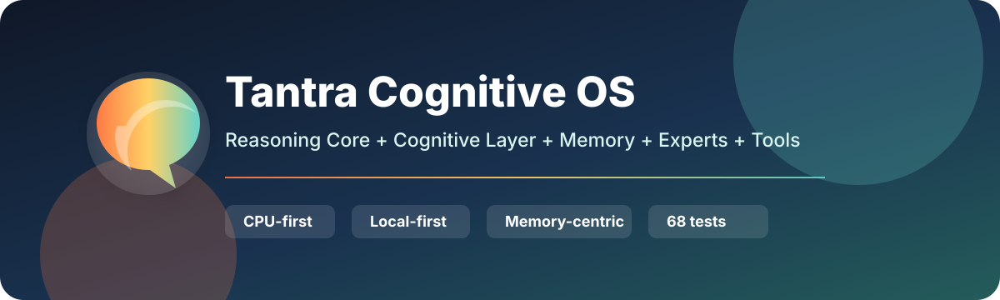
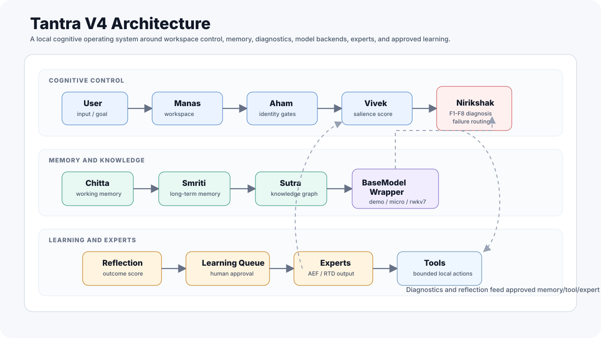
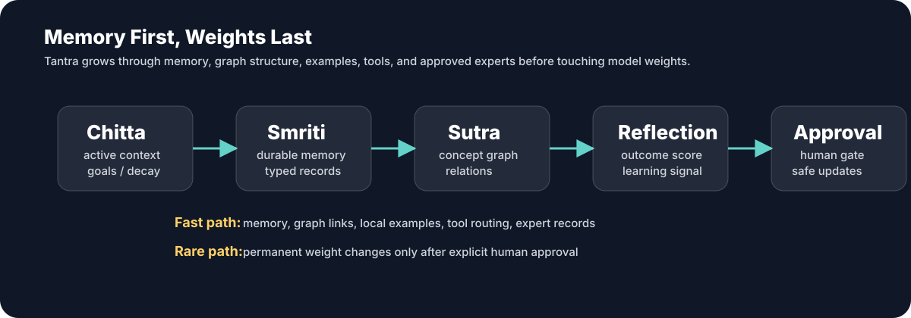

# Tantra-LLM: The Multimodal Brain (v1.0.0)



---

## Primary System

Tantra-LLM trains a neuroplastic transformer (`NpDnaModel`) from scratch on CPU.
NP-DNA = NeuroPlastic DNA Network: each strand is a small learnable seed, expanded
into a real weight matrix by a shared hypernetwork (`Genome`, in `model.py`) — not
a stored dense matrix per strand.

### Layout (flat — no sub-packages, 12 files)

| Module | Responsibility |
| :--- | :--- |
| `npdna/architecture.py` | Config + mesh: `NpDnaConfig`, `LayerSpec`, `MeshConfig`, `AttentionStrand`, `NeuralMesh`, `CategoryMesh` |
| `npdna/schema.py` | Shared API contracts: `TantraRequest`, `TantraResponse`, `BaseTantraAdapter`, `ModalityEncoder`, `MemoryStore`, `TantraMiddleware`, `IDENTITY`, `MODEL_CONFIG`, `*Settings`, `get_settings()` |
| `npdna/model.py` | `NpDnaConfig`, `NpDnaModel` / `NpDnaCore`, `GenerationMixin`, `Genome` (DNA weight generator), LoRA, built-in vision/audio projectors |
| `npdna/tokenizer.py` | BPE tokenizer with dynamic growth (`add_token`, `allow_growth`, `target_vocab_size`) |
| `npdna/train.py` | Training loop, curriculum, dataset, checkpointing, `--fusion` mode, `DynamicGrowthController` |
| `npdna/serving.py` | CLI (`chat_main`, `info_main`, entry point `npdna-chat`) + FastAPI server (`serve_main`) + Gradio web studio (`build_app`, `studio_main`) |
| `npdna/brain.py` | `PlasticityEngine`, `NpDnaTopicClassifier`, `NpDnaAgent`, multimodal prompts, CPU quantization/benchmarking |
| `npdna/cognition.py` | `ComputeRouter`, `DynamicContextManager`, `EventBus`, `InMemoryVectorStore`, `MemoryCortex`, `FastResponseMemory` |
| `npdna/fusion.py` | `MultimodalDataset` (projectors are built-in `nn.Linear` in `model.py`, trained via `--fusion`) |
| `npdna/sensory.py` | Vision/Audio/TTS encoders + `VisionOrgan`, `VoiceOrgan`, `SentimentCore` |
| `npdna/inference.py` | `UnifiedInferenceHub` + provider adapters (NpDna, RWKV, OpenAI, Gemini), personality/safety middleware |
| `npdna/__init__.py` | Package init |

> Files formerly listed in the README — `genome.py`, `mesh.py`, `cortex.py`, `cli.py`,
> `middleware.py`, `atulya_core.py`, `optimization.py`, `api_server.py`, `studio.py` —
> were consolidated into the flat layout above. `tools/` scripts are standalone: they
> `import npdna` and run once. The package also registers `npdna-chat`,
> `npdna-train`, `npdna-info`, `npdna-benchmark`, `npdna-cpu-benchmark`,
> `npdna-release`, `npdna-studio`, and `npdna-serve`.

### Checkpoint layout

```
model/
  best/              # Best EMA checkpoint (promoted on new best)
  latest/            # Rolling latest checkpoint (keeps latest.1 / latest.2 / latest.3)
  final/             # Final checkpoint at end of training
  step_N/            # Milestone checkpoints every --ckpt-every steps
  tokenizer*.json    # BPE assets alongside the latest checkpoint
```

Default `--resume-from best` falls back to `latest` when no best slot exists yet.

On resume, stale size-mismatched weight tensors (e.g. obsolete 512/128-dim
projector slices left by older checkpoints) are detected and stripped automatically,
so `NpDnaCore.load` resumes silently instead of crashing on shape mismatch.
Set `NPDNA_REPAIR=1` to force-strip every mismatched key for a full rebuild.
Checkpoint writes are atomic (`os.replace`) with best-effort rolling backups
(`latest.1`/`latest.2`/`latest.3`) and Windows-safe cleanup.



### Dataset pipeline

```
Download/train_pack/train_pack_all_expanded_1040k.jsonl   # cleaned single pack
Download/seed/small_seed.jsonl                            # 4k-row quick seed (optional)
tools/build_synthetic.py (chat|code|reasoning|teacher|emotion|spatial|action|factual|general) -> tools/precompute_embeddings.py
```

---

## 🧠 Multimodal Fusion (Activation-Level)

Design intent: **text weights stay the only weights**. Multimodal = activation/encoders
on top of the same text checkpoint. Built-in `vision_projector` / `audio_projector`
live in `model.pt`; train them with:

```bash
python npdna/train.py --fusion --fusion-ratio 0.5 --resume model/latest
```

> Encoder output dim and projector input dim must match end to end
> (`npdna/sensory.py` / `npdna/model.py`) — both are 4096. The projectors are the
> model's built-in `nn.Linear(4096, H)` layers, saved inside `model.pt`; the
> standalone MLP trainer was removed so there is exactly one projector class and
> one checkpoint format.

Use `--skip-final-eval` on CPU to keep training exit clean. Fusion is part of
normal training — there is no separate fusion entrypoint or checkpoint; run
`python -m npdna.train --fusion` (see `npdna/train.py` for the full flag set).

---

## 🔬 The Law of TANTRA-LLM

1.  **The Law of Identity**: A request should look identical to the user, regardless of whether it hits a cloud API or local weights.
2.  **The Law of Transparency**: Every inference event must report real-world token usage and latency.
3.  **The Law of Fallback**: No single provider should ever be a single point of failure.

---

## 🧪 Rituals of Inference

### 🟢 Ritual 1: The Model Chameleon
* **Command**: `"Switch brain to local and summarize this file."`
* **Behavior**: Tantra-LLM should unload cloud logic and engage local VLLM without interrupting the user's flow.
* **Proof**: Proof of **Dynamic Adapter Switching**.

### 🟡 Ritual 2: The Encoder Sync
* **Command**: Ask for a token count of a complex string across 3 different models.
* **Behavior**: Tantra-LLM should return a unified comparison matrix.
* **Proof**: Proof of **Cross-Provider Normalization**.

---



## Serving safely

Start the local API with `npdna-serve`, or use `tools/start_api.ps1`. The launch
scripts bind to `127.0.0.1` by default. Only deliberately set `NPDNA_HOST` (or
the script host argument) to a LAN address after placing the service behind an
authenticated reverse proxy.

The REST API provides local generation by default. Cloud adapters are disabled
at the HTTP boundary until both `NPDNA_ENABLE_CLOUD_PROVIDERS=1` and a strong
`NPDNA_API_KEY` are configured; callers must send that key in `X-API-Key` for
OpenAI or Gemini requests. Public Studio shares require
`NPDNA_STUDIO_USERNAME` and `NPDNA_STUDIO_PASSWORD`; the same credentials are
required for any Studio host other than loopback.

Set `NPDNA_API_KEY` for every network-accessible API deployment. Without it,
the API rejects non-loopback clients. When set, every API request must include
the matching `X-API-Key`. `NPDNA_RATE_LIMIT_PER_MINUTE` defaults to `60` per
client, and `NPDNA_MAX_CONCURRENT_REQUESTS` controls the server-wide inference
limit (default `1`, maximum `16`). Use an authenticated reverse proxy for
distributed rate limits and TLS.

New checkpoints include SHA-256 hashes for their model, tokenizer, and Cortex
artifacts. For tamper detection, set `NPDNA_CHECKPOINT_HMAC_KEY` when saving and
loading checkpoints; loading then requires a valid HMAC. Set
`NPDNA_REQUIRE_CHECKPOINT_INTEGRITY=1` to reject legacy checkpoints that lack
integrity metadata.

The "Rituals of Inference" section is a design target, not a feature list: the
model does not dynamically unload providers, use vLLM, or offer a
cross-provider token-count comparison.

## 🗺️ Roadmap

### Phase 1: Foundation (v1.0.0)
- [x] Universal Adapter interface.
- [x] Production Inference Hub with middleware hooks.
- [x] CPU-optimized local provider stubs.

### Phase 2: Optimization (v1.1.0)
- [ ] Quantization-aware training stubs.
- [ ] KV-cache orchestration for multi-turn threads.
- [ ] Integrated RAG streaming via `Tantra-Smriti`.

### Phase 3: Neuronal Agency (v2.0.0)
- [ ] Self-adaptive routing (Auto-selecting best model per node).
- [ ] Peer-to-peer compute sharing.
- [ ] Real-time emotional modulation via `Tantra-Sentiment`.

---

## Known Gaps

- Training is CPU-only; a GPU build would speed up the 1M-row pack dramatically.
- `latest/metadata.json` step (~23k) vs `training_state.pt` step (16,780) discrepancy — not audited.
- Fusion smoke runs exit cleanly; long real-pack fusion runs are untested end-to-end.
- Vision/audio encoders require optional deps (`whisper`, transformers) installed at runtime.

## Reliability notes

- `NpDnaCore.load` raises a typed `RuntimeError` listing the first size-mismatched key
  (key + checkpoint shape vs model shape) instead of a silent, confusing crash; set
  `NPDNA_REPAIR=1` to auto-strip mismatched tensors and rebuild. Covered by
  `tests/test_model.py` (`test_load_rejects_shape_mismatch`, `test_load_repair_strips_mismatched`).
- `--distill` degrades gracefully: a missing `transformers` install warns and continues
  instead of aborting the whole training run.
- The repository includes pytest coverage for model, training, policy, and
  inference behavior. Run `python -m pytest` in a configured Python 3.11+
  environment to establish the current passing count.

---

*Engineered with discipline by Antigravity in pursuit of the Atulya Tantra.*
