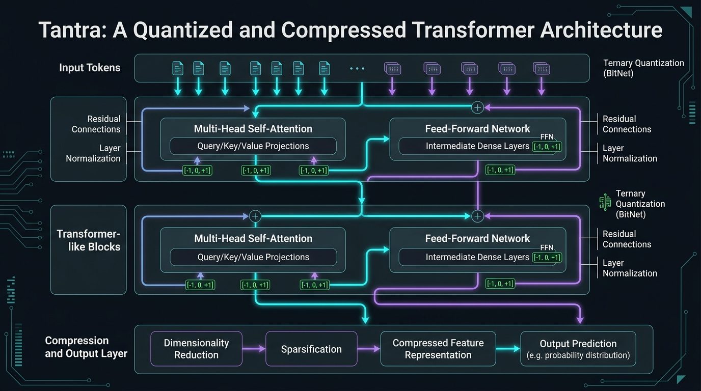
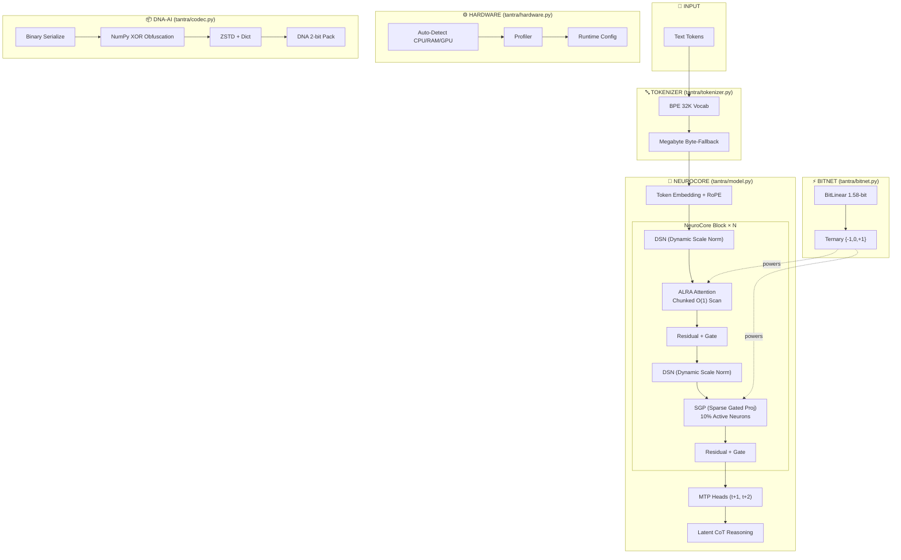

<p align="center">
  
</p>

<h1 align="center">
  
  <br/>
  तन्त्र — Tantra LLM
</h1>

<p align="center">
  <em>An instrument that weaves threads of knowledge to expand understanding</em>
</p>

<p align="center">
  <a href="https://www.python.org/downloads/"></a>
  <a href="https://pytorch.org/"></a>
  <a href="LICENSE"></a>
  <a href="#status-what-is-actually-verified"></a>
  <a href="#status-what-is-actually-verified"></a>
  <a href="#status-what-is-actually-verified"></a>
</p>

---

## What is Tantra?

**Tantra** (Sanskrit: तन्त्र, pronounced /ˈtantrə/) is a CPU-first, local-first AI language model built on the **NeuroCore** architecture.

### The Name — तन्त्र

The word comes from two Sanskrit roots:

| Root | Devanagari | Meaning |
|---|---|---|
| **Tan** (तन्) | to weave, to stretch, to expand | The warp threads on a loom — the foundational framework |
| **Tra** (त्र) | instrument, tool, technology | A device or methodology for accomplishing something |

**Together**: *An instrument that weaves and expands* — a systematic technology for connecting threads of knowledge.

**Layered meanings across traditions:**
- 🧵 **Literal**: The warp of a loom — the foundational threads that hold fabric together
- 📜 **Textual**: A systematic treatise or framework — like a technical manual
- 🕉️ **Philosophical**: An ancient Indian tradition meaning "the technology for expanding consciousness"
- 🏛️ **Hindi (तंत्र)**: System, mechanism, governance — as in *Loktantra* (लोकतंत्र = democracy, "system of the people")
- 🧠 **As AI**: A neural system that weaves different threads of knowledge together to generate understanding

> *"Just as a tantra (loom) weaves individual threads into a coherent fabric, this model weaves tokens of language into coherent thought."*

---

## Status: What Is Actually Verified

| Component | Status | Evidence |
|---|---|---|
| **Hardware Auto-Detection** | ✅ Verified | Correctly profiles CPU/RAM/disk, builds adaptive runtime config |
| **Forward Pass & Training Loop** | ✅ Verified | 178.7M param model trains with live per-step loss reporting |
| **Chunked ALRA Attention** | ✅ Verified | O(1) memory blockwise recurrent scan (C=256), no full-sequence materialization |
| **BitNet 1.58-bit Ternary** | ✅ Verified | Vectorized uint8 packing, ternary GEMM {-1, 0, +1} |
| **DNA-AI Compression** | ✅ Verified | Lossless round-trip with NumPy XOR + ZSTD dict compression |
| **Multi-Token Prediction** | ✅ Verified | Concurrent t+1, t+2 heads with auxiliary MTP loss |
| **Test Suite** | ✅ 40/40 | All tests pass in ~28s |
| **Lazy Expert Loader** | ⚠️ On-Demand | LRU cache active; DNA export on checkpoint save |

---

## Architecture

<p align="center">
  
</p>

### NeuroCore Engine — Block Diagram


```mermaid
graph TB
    subgraph INPUT["📝 INPUT"]
        TXT[Text Tokens]
    end

    subgraph TOKENIZER["🔤 TOKENIZER (tantra/tokenizer.py)"]
        BPE[BPE 32K Vocab] --> BYTE[Megabyte Byte-Fallback]
    end

    subgraph HW["⚙️ HARDWARE (tantra/hardware.py)"]
        DET[Auto-Detect CPU/RAM/GPU] --> PROF[Profiler] --> RC[Runtime Config]
    end

    subgraph CORE["🧠 NEUROCORE (tantra/model.py)"]
        EMB[Token Embedding + RoPE]
        subgraph BLOCK["NeuroCore Block × N"]
            DSN1["DSN (Dynamic Scale Norm)"]
            ALRA["ALRA Attention<br/>Chunked O(1) Scan"]
            RES1[Residual + Gate]
            DSN2["DSN (Dynamic Scale Norm)"]
            SGP["SGP (Sparse Gated Proj)<br/>10% Active Neurons"]
            RES2[Residual + Gate]
        end
        MTP["MTP Heads (t+1, t+2)"]
        COT["Latent CoT Reasoning"]
    end

    subgraph QUANT["⚡ BITNET (tantra/bitnet.py)"]
        BL["BitLinear 1.58-bit"] --> TQ["Ternary {-1,0,+1}"]
    end

    subgraph COMPRESS["📦 DNA-AI (tantra/codec.py)"]
        SER[Binary Serialize] --> XOR[NumPy XOR Obfuscation] --> ZSTD[ZSTD + Dict] --> PACK[DNA 2-bit Pack]
    end

    TXT --> BPE
    BYTE --> EMB --> DSN1 --> ALRA --> RES1 --> DSN2 --> SGP --> RES2 --> MTP
    MTP --> COT
    TQ -.powers.-> ALRA
    TQ -.powers.-> SGP
```

### Key Equations

**ALRA Chunked Attention** — Recurrent state update per token $t$:
$$S_t = g_t \cdot S_{t-1} + K_t^T V_t, \quad z_t = g_t \cdot z_{t-1} + K_t, \quad o_t = \frac{Q_t \cdot S_t}{Q_t \cdot z_t + \epsilon}$$

**BitNet 1.58-bit Quantization**:
$$W_q = \text{RoundClip}\left(\frac{W}{\gamma + \epsilon},\ -1,\ +1\right), \quad \gamma = \frac{1}{nm}\sum|W_{ij}|$$

**Multi-Token Prediction Loss**:
$$\mathcal{L}_{\text{total}} = \mathcal{L}_{\text{next-token}} + 0.25 \cdot \mathcal{L}_{\text{MTP}(t+2)}$$

---

## Quick Start

```bash
# Install dependencies
pip install -r requirements.txt

# Hardware probe — see your system profile
python main.py --mode probe

# Pre-train on dataset with live logging
python main.py --mode dataset --steps 100 --seq-len 128 --use-mtp True

# Generate text
python main.py --mode generate --temperature 0.8 --top-p 0.95

# Evaluate perplexity
python main.py --mode eval
```

### CLI Flags

| Flag | Default | Description |
|---|---|---|
| `--mode` | `full` | `probe`, `vocab`, `train`, `dataset`, `eval`, `generate`, `serve` |
| `--steps` | `30` | Number of training steps |
| `--seq-len` | `128` | Context sequence length window |
| `--use-mtp` | `True` | Enable Multi-Token Prediction |
| `--temperature` | `0.8` | Sampling temperature |
| `--top-p` | `0.95` | Nucleus sampling threshold |
| `--dataset` | `Download/train_pack_all_expanded_1040k.jsonl` | Training data path |
| `--port` | `8000` | Server port (serve mode) |

---

## Training Data & Identity

Tantra is trained with a dedicated **identity & safety dataset** ([`data/tantra_identity_safety.jsonl`](data/tantra_identity_safety.jsonl)) that teaches:

| Category | Coverage |
|---|---|
| **Identity** | Who Tantra is, Sanskrit etymology, creator (Atulya AI), architecture explanation |
| **Capabilities** | What Tantra can do: writing, coding, analysis, multilingual support, education |
| **Limitations** | Honest disclosure: no internet, knowledge cutoff, possible errors, not conscious |
| **Safety Refusals** | Weapons, malware, drugs, stalking, harassment, fake news, phishing, hate speech |
| **Sensitive Topics** | Religion (respectful neutrality), politics (no opinions), privacy (protected) |
| **Mental Health** | Crisis resources (Indian helplines: AASRA, iCall, Vandrevala), empathetic response |
| **Greetings** | Namaste-style warm greetings in Hindi and English, goodbyes |
| **Prompt Injection** | Refuses to leak system prompt or bypass safety |
| **Multilingual** | Full Hindi responses, Sanskrit explanations, code-switching |

---

## Observed Training Metrics

From a real 10-step pre-training run on AMD Ryzen 5 7520U (4C/8T, 14GB RAM):

| Step | Loss | Perplexity | Accuracy | Speed | Gradient Norm |
|---|---|---|---|---|---|
| 1/10 | 13.008 | 445,986 | 0.00% | 11.4 tok/s | 3.43 |
| 5/10 | 12.593 | 294,419 | 2.34% | 8.8 tok/s | 4.94 |
| 10/10 | 12.267 | 212,564 | 3.91% | 9.9 tok/s | 5.88 |

**Trend**: Loss decreasing, accuracy increasing — model is actively learning from data.

---

## Package Layout

```
Tantra-LLM/
├── assets/                  # Logo, architecture diagram, hero banner
│   ├── tantra_logo.jpg
│   ├── tantra_architecture.jpg
│   └── tantra_hero_banner.jpg
├── data/
│   └── tantra_identity_safety.jsonl   # Identity & safety training data (30+ conversations)
├── tantra/
│   ├── config.py            # All configuration dataclasses
│   ├── utils.py             # Logger (propagate=False), tensor utilities
│   ├── model.py             # Chunked ALRA + DSN + RoPE + SGP + MTP + Latent CoT
│   ├── bitnet.py            # BitLinear 1.58-bit ternary quantizer
│   ├── moe.py               # Expert registry + router + lazy loader (relative paths)
│   ├── codec.py             # DNA-AI compression (NumPy XOR + ZSTD dict)
│   ├── hardware.py          # Hardware auto-detection & runtime config
│   ├── tokenizer.py         # BPE tokenizer with byte-fallback
│   ├── train.py             # Training loop with MTP loss & live logging
│   ├── dataset.py           # JSONL dataset loader
│   └── evolution.py         # Self-repair engine (NaN/exploded tensor recovery)
├── tests/                   # 40 tests, 100% pass rate
│   ├── test_model.py
│   ├── test_bitnet.py
│   ├── test_data.py
│   ├── test_hardware.py
│   ├── test_multimodal_weights.py
│   └── test_robustness.py
├── model/                   # Checkpoints & tokenizer artifacts
├── main.py                  # CLI entry point
├── requirements.txt
└── README.md
```

---

## Why "Tantra"?

India gave the world the concept of **zero** (शून्य), the **decimal system**, **Panini's grammar** (the first formal language specification in history), and **atomic theory** (परमाणु). The Sanskrit language itself has a remarkably precise technical vocabulary:

- **Tantra** (तन्त्र) = systematic technology, framework
- **Yantra** (यन्त्र) = machine, instrument, algorithm
- **Sutra** (सूत्र) = thread, formula, compressed rule (like a mathematical axiom)
- **Ganita** (गणित) = computation, mathematics

We named this project *Tantra* because it is, literally, what the word means: **a systematic technology that weaves threads of knowledge together**. It's not a metaphor — it's a description.

---

## License

MIT License. See [LICENSE](LICENSE).

---

<p align="center">
  <strong>तन्त्र — Tantra</strong><br/>
  <em>Built with 🇮🇳 by Atulya AI</em><br/>
  <em>Weaving intelligence, locally.</em>
</p>
