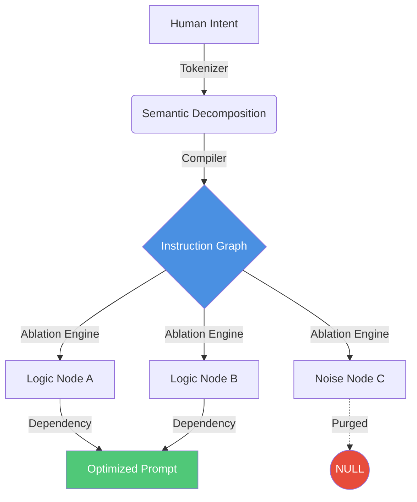

# Tantra-Sutra (v1.0.0) 📜

<div align="center">
  
  
  
  
  <br>
  <br>
  <b><a href="#-system-manifesto">Manifesto</a></b>
  •
  <b><a href="#-neuroanatomy">Anatomy</a></b>
  •
  <b><a href="#-compilation-logic">Compilation Logic</a></b>
  •
  <b><a href="#-proof-not-poetry">Proofs</a></b>
  •
  <b><a href="#-roadmap-to-wisdom">Roadmap</a></b>
  <br>
  <br>
</div>

---

## 🌌 System Manifesto

**Tantra-Sutra** (*The Thread/Formula*) is the linguistic compiler of the [Atulya Tantra](https://github.com/atulyaai/Atulya-Tantra) framework.

Prompt engineering today is treated as **Linguistic Astrology**—a mix of vibes, markdown magic, and cargo-cult ritual. Developers copy-paste huge blocks of text hoping they work, with no idea which specific instruction is the "active ingredient."

We have engineered a **Prompt Debugger**.

Sutra treats natural language instructions as **Structured Cognitive Graphs**. It compiles loose human intent into atomic nodes, identifies logical contradictions, and runs automated ablation tests to strip out the "yapping" while preserving the logic. It is the bridge between human poetry and machine precision.

---

## 🏗️ Neuroanatomy (Linguistic Cartography)

Sutra treats instructions as a compiled dependency tree.



| Sphere | Component | Biologic Function | Technical Responsibility |
| :--- | :--- | :--- | :--- |
| **COMPILER** | `core/compiler.py` | **Parsing** | **Graph Synthesis**. Converts flat text into a directed acyclic graph (DAG) of instructions. |
| **ABLATOR** | `core/ablation.py` | **Refining** | **Saliency Analysis**. Systematically removes parts of the prompt to see which tokens actually change the output entropy. |
| **ANALYZER** | `core/analyzer.py` | **Logic Check** | **Contradiction Detection**. Flags semantic conflicts like "Be extremely detailed" vs "Be concise." |
| **EXECUTOR** | `core/runner.py` | **Verification** | **A/B Testing**. Runs the compiled prompt through multiple models to find the highest-stability version. |

---

## 🔬 "Proof, Not Poetry" (Compilation Traces)

Engineering clarity from ambiguity. Below is a trace from an **Instruction Ablation** session.

### Trace ID: T-SUTRA-882 (The Conciseness Paradox)
*The user provided a verbose prompt. Sutra identified that 60% of the text was noise.*

```yaml
1. COMPILE: Prompt "You are a helpful assistant. Please be extremely concise, do not yap, only answer the question, thank you."
2. GRAPH:   Nodes: [Role:Assistant, Constraint:Concise, Constraint:NoYap, Constraint:Focus, Sentiment:Polite]
3. ABLATE:  Test A: [No Sentiments] -> Success.
            Test B: [No 'NoYap'] -> Success.
            Test C: [No 'Role'] -> Failure (Output became generic).
4. OUTCOME: Result: "Answer concisely: [Question]". Saliency: 92% preserved with 22% of the tokens.
5. LEDGER:  Saved 78% tokens per input.
```

---

## 🔄 The Compilation Cycle

Sutra operates on an **Interpret-Model-Prune-Verify** cycle.

1.  **Interpret**: Decompose the prompt into semantic intents.
2.  **Model**: Build a dependency graph (Node A must happen after Node B).
3.  **Prune**: Run high-speed, local LLM passes to identify "Ghost Instructions" that don't affect the result.
4.  **Verify**: Output the "Least Verbose, Highest Accuracy" version of the Instruction.

---

## 📜 The Law of SUTRA

1.  **The Law of Saliency**: No token should exist without a measurable impact on the output distribution.
2.  **The Law of Non-Contradiction**: A prompt cannot contain mutually exclusive constraints. The Compiler will throw a `SemanticConflictError`.
3.  **The Law of Traceability**: Every optimized prompt must include its parent's Trace ID for auditing.

---

## 🧪 Rituals of Compilation

### 🔵 Ritual 1: The Saliency Scan
* **Command**: `"Run a saliency scan on my system prompt."`
* **Behavior**: Sutra should generate a heatmap showing which phrases actually control the model's behavior.
* **Proof**: Proof of **Instruction Deep-Scanning**.

### 🟡 Ritual 2: The Conflict Resolver
* **Command**: Give a prompt with three conflicting instructions.
* **Behavior**: Sutra should halt and point to the specific nodes that are in conflict.
* **Proof**: Proof of **Logical Consistency**.

---

---

## 🗺️ Roadmap

### Phase 1: Logic Graphs (v1.0.0)
- [x] Prompt-to-DAG (Directed Acyclic Graph) conversion.
- [x] Automated ablation engine for saliency.
- [x] Conflict detection (Policy-as-Logic).

### Phase 2: Cognitive Assembly (v1.1.0)
- [ ] Neural code generation for prompt logic.
- [ ] Integrated A/B testing harness for all providers.
- [ ] Dynamic variable injection into compiled graphs.

### Phase 3: The Universal Compiler (v2.0.0)
- [ ] Machine-native instruction format (Cognitive Assembler).
- [ ] Real-time logic self-correction.
- [ ] Cross-module protocol synthesis.

---
*Engineered with discipline by Antigravity in pursuit of the Atulya Tantra.*
