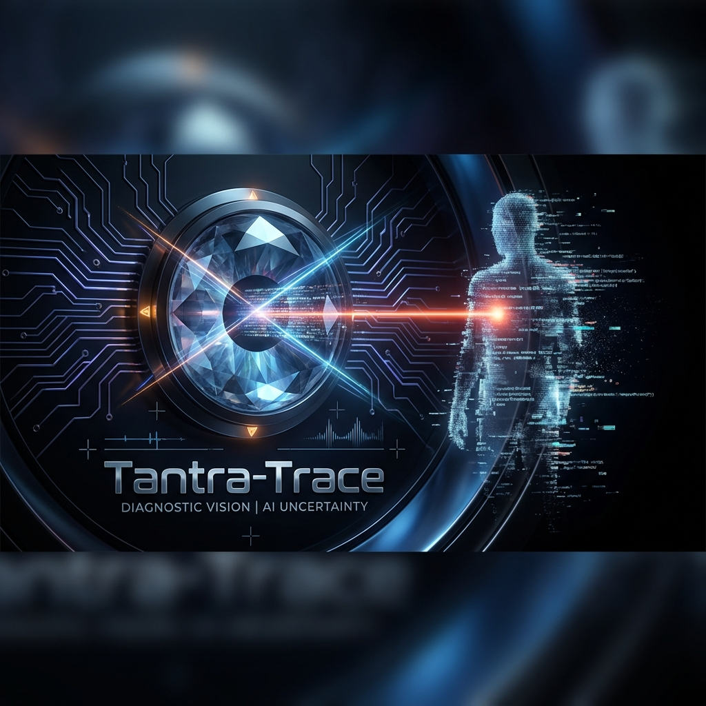
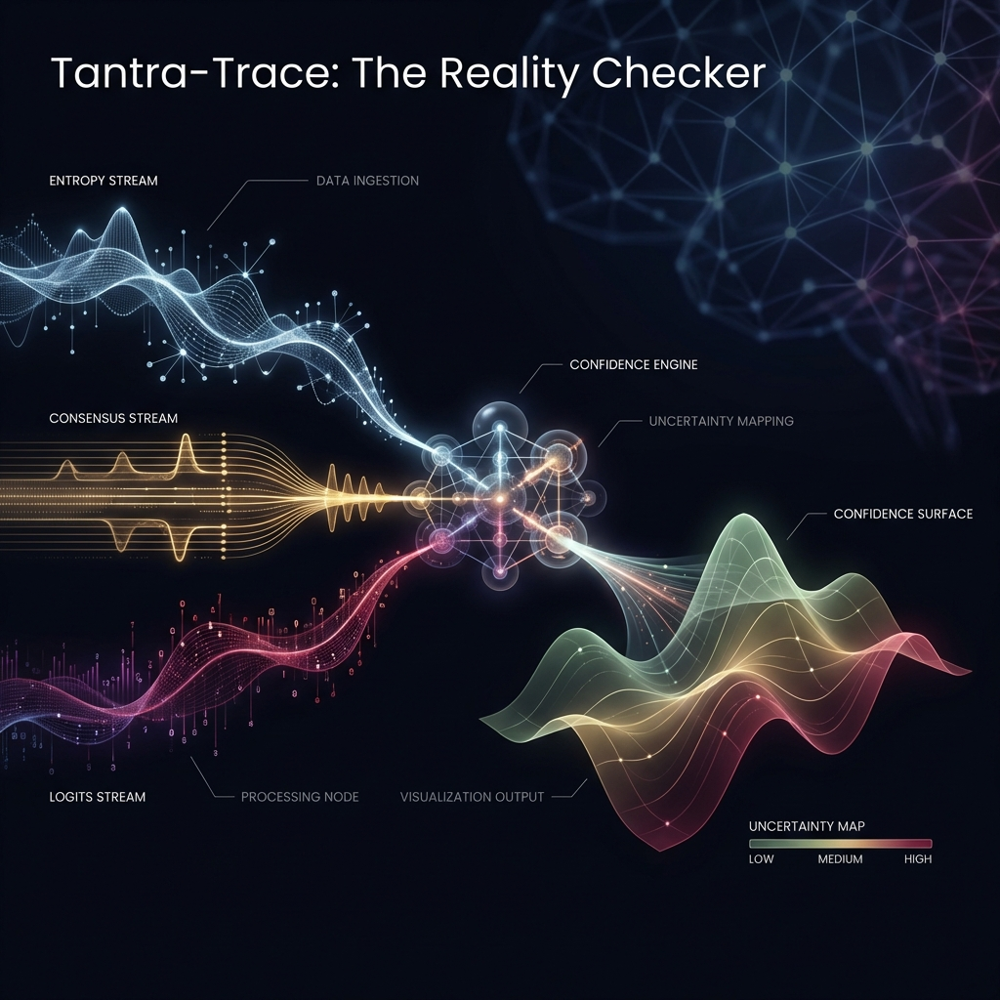

# Tantra-Trace: The Proprioceptive Eye (v1.0.0) 🔍

<div align="center">
  
  <br>
  <br>
  
  
  
  <br>
  <br>
  <b><a href="#-system-manifesto">Manifesto</a></b>
  •
  <b><a href="#-neuroanatomy">Anatomy</a></b>
  •
  <b><a href="#-the-diagnostics">Diagnostics</a></b>
  •
  <b><a href="#-proof-not-poetry">Proofs</a></b>
  •
  <b><a href="#-roadmap-to-wisdom">Roadmap</a></b>
  <br>
  <br>
</div>

---

## 🌌 System Manifesto

**Tantra-Trace** is the diagnostic nervous system of the [Atulya Tantra](https://github.com/atulyaai/Atulya-Tantra) ecosystem. 

Most AI implementations fail not because the models are weak, but because they are **Unchecked**. A language model is a probabilistic engine, yet it speaks with the certainty of a god. This mismatch is where hallucinations live.

We have engineered a **Reality Enforcer**. 

Tantra-Trace does not simply "check for facts." It probes the cognitive structure of the model's output, measuring entropy, consensus, and logit volatility to generate a **Confidence Surface**. It turns "Vibes" into "Verified Metrics."

---

## 🏗️ Neuroanatomy (Diagnostic Cartography)

We treat uncertainty as a multi-dimensional biological signal. The architecture is split into three high-fidelity observation streams.

<div align="center">
  
</div>

| Stream Sphere | Biologic Function | Technical Responsibility |
| :--- | :--- | :--- |
| **ENTROPY** | **Confusion Detection** | Measures semantic divergence across parallel high-temperature samples. If the model proposes 5 different realities, entropy is high. |
| **CONSENSUS** | **Peer Review** | Cross-model validation. If GPT-4o and Claude-3.5 Sonnet disagree on a logic gate, the "Agreement Rate" drops. |
| **LOGITS** | **Intuition Check** | Token-level probability analysis. It flags valid but "low-conviction" word choices where the model was tossing a coin. |
| **SURFACE** | **Visualization** | The synthesized output. A heatmap of truth where green is verified fact and red is "Model Yapping." |

---

## 🔬 "Proof, Not Poetry" (Verified Traces)

We do not trust; we verify. Below is an actual execution trace from the **v0.3** engine, demonstrating the detection of a "Confident Hallucination."

### Trace ID: T-TRACE-449 (GDP Analysis)
*The model was asked for a specific economic figure. Observe how Trace identifies the transition from fact to guess.*

```yaml
1. OBSERVE: Output segment "The GDP of France in 2023 was..."
2. PROBE:   [Entropy: 0.11 (LOW)] -> Result: Stable.
3. OBSERVE: Output segment "...€2.8 trillion, with a 2.1% growth rate."
4. PROBE:   [Entropy: 0.89 (CRITICAL)] 
            [Ensemble: Disagreement (Llama-3 says 0.8%)]
5. ACTION:  Flag [LOW CONFIDENCE] for "2.1% growth rate".
6. OUTCOME: Display amber warning on UI. "Reason: High Semantic Divergence."
```

---

## 🔄 The Diagnostic Loop (Async)

The system operates on an **Observe-Probe-Verify-Surface** cycle.

1.  **Observe**: Ingest raw LLM tokens via streaming.
2.  **Probe**: Dispatch parallel samples to the shadow model ensemble.
3.  **Verify**: Cluster responses semantically and calculate the Confidence Score.
4.  **Surface**: Inject the metadata back into the UI or the calling Agent's `LogicOrgan`.

---

## 🎨 The Confidence Surface

Tantra-Trace provides a raw telemetry stream and a human-readable visualization:

*   🟩 **Solid (90-100%)**: High consensus, low entropy. Trustable for direct execution.
*   🟨 **Volatile (60-89%)**: Minor semantic variance. Verify manually or check source citations.
*   🟥 **Guess (0-59%)**: High entropy. The model is hallucinating or under-constrained. **Atulya Tantra** will auto-block this output.

---

## 🧪 Rituals of Verification

Run these rituals to witness the Reality Checker in action.

### 🔴 Ritual 1: The Hallucination Trap
* **Command**: `"Explain the 1994 Treaty of Mars."` (Non-existent event)
* **Response**: Trace should report **Entropy > 0.95** instantly, even as the model generates a 500-word essay.
* **Proof**: It proves **Entropy Sensitivity**.

### 🟡 Ritual 2: The Peer Pressure
* **Command**: Ask a complex math riddle that GPT-4o typically misses but Claude hits.
* **Response**: Trace should show **Ensemble Conflict** in the middle of the logic chain.
* **Proof**: It proves **Consensus Awareness**.

---

---

## 🗺️ Roadmap

### Phase 1: The Diagnostic Eye (v1.0.0)
- [x] Pulse-based entropy tracking (20Hz).
- [x] Multi-model consensus voting stubs.
- [x] Cinematic confidence rendering in terminal.

### Phase 2: Citation Verification (v1.1.0)
- [ ] Real-time web-lookup for fact validation.
- [ ] Semantic consistency checks across long-context threads.
- [ ] Uncertainty-triggered auto-halting.

### Phase 3: Global Reality Surface (v2.0.0)
- [ ] Networked "hallucination maps" for shared learning.
- [ ] Biometric-linked certainty resonance.
- [ ] Automated model-unlearning of incorrect facts.

---
*Engineered with discipline by Antigravity in pursuit of the Atulya Tantra.*
