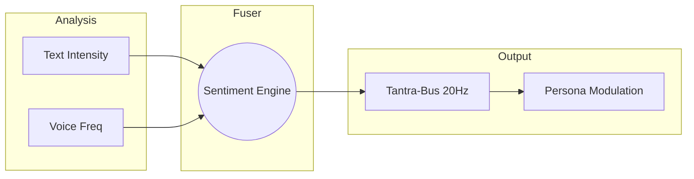

# Tantra-Sentiment: The Empathy Core ❤️

  
  

---

## 🏗️ Architecture

---

## 🌌 System Manifesto

**Tantra-Sentiment** (*The Heart*) is the emotional resonance layer of the ecosystem.

Logic alone is not AGI. A true Jarvis-level assistant must understand the user's frustration, excitement, or urgency. Tantra-Sentiment analyzes text and voice frequencies to adjust the AGI's persona, ensuring that **Atulya-Prana** remains a supportive and human-centric partner.

---

## 🛠️ Functionality
- **Emotional Ledger**: Tracking the "Vibe" of the current session in real-time.
- **Humor Injection**: Dynamically adjusting tone based on user personality in [Tantra-Smriti](https://github.com/atulyaai/Tantra-Smriti).
- **Stress Monitoring**: Detecting high-entropy user states and triggering [Tantra-Raksha](https://github.com/atulyaai/Tantra-Raksha) safety protocols if needed.

---

## 🗺️ Roadmap

### Phase 1: Resonance (v1.0.0)
- [x] Basic sentiment classification baseline.
- [x] Inter-repo persona modulation hooks.
- [x] Real-time Vibe broadcasting (20Hz).

### Phase 2: Deep Empathy (v1.1.0)
- [ ] Facial micro-expression analysis via `Tantra-Vision`.
- [ ] Bio-metric fusion stubs (HRV/Stress).
- [ ] Long-term user affinity mapping.

### Phase 3: Proactive Support (v2.0.0)
- [ ] Autonomous mental-health guardrails.
- [ ] Collaborative humor and creative synergy loops.
- [ ] Global empathy clusters for swarms.

---
*The Emotional Nerve of Autonomy.*
