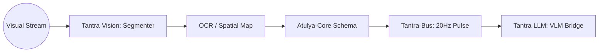

# Tantra-Vision: The Ocular Plane 👁️

  
  
  

---

## 🏗️ Architecture

---

## 🌌 System Manifesto

**Tantra-Vision** (*The Sight*) provides spatial awareness to the AGI organism. 

For Skynet-level automation, the system must "see" what the user sees—whether it's the current code in the IDE, a UI bug on the screen, or the physical environment via camera. Tantra-Vision processes visual streams into meaningful semantic tokens for **Tantra-LLM**.

---

## 🛠️ Capabilities
- **Screen Proprioception**: Analyzing the current state of the desktop and active windows.
- **Multimodal Fusing**: Combining visual context with [Tantra-Smriti](https://github.com/atulyaai/Tantra-Smriti) for deep environmental memory.
- **Autonomous Observation**: Identifying changes in the environment at 20Hz via [Tantra-Bus](https://github.com/atulyaai/Tantra-Bus).

---

## 🗺️ Roadmap

### Phase 1: Sight Initialization (v1.0.0)
- [x] Efficient screen capture and tiling.
- [x] GPT-4o / Gemini Flash multimodal adapter.
- [x] Local YOLO/VIT stubs for low-latency tagging.

### Phase 2: Spatial Memory (v1.1.0)
- [ ] Persistent spatial graph in `Tantra-Smriti`.
- [ ] Real-time UI element tracking (LSP for pixels).
- [ ] Multi-camera coordination for physical nodes.

### Phase 3: Predictive Sight (v2.0.0)
- [ ] Temporal visual forecasting (predicting the next UI state).
- [ ] Fully autonomous "Screen Driving" (Mouse control via Vision).
- [ ] Thermal/IR stream fusion for physical robotics.

---
*The Ocular Nerve of Autonomy.*
